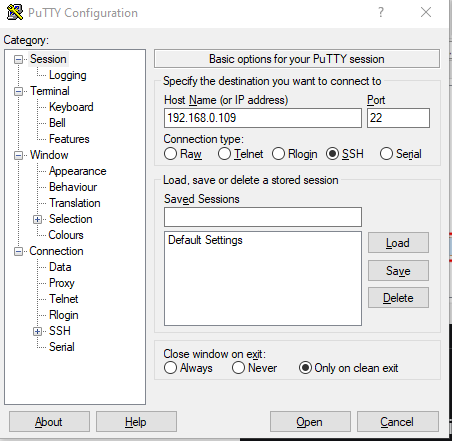

# Raspberry PI Headless SSH and WI-FI configuration 

setting up the Raspberry Pi 3 & 4 Model B+ for headless SSH access over WiFi

######## Step 1. Download a lite Raspbian image
downloaded [Raspbian](https://www.raspberrypi.org/downloads/raspbian/) imagefrom here:
[https://www.raspberrypi.org/downloads/raspbian/]

#### Step 2. Burn the Raspbian image to the SD card
 

Browse to [https://www.balena.io/etcher/]
Download the version for your operating system
Run the installer

Put a blank mini SD card and adapter into your machine. No need to format it. You can use a new SD card right out of the package.

- Select image - browse to the zip file you downloaded from Raspbian
- Select drive - it may find the SDHC Card automatically
- Click Flash!

After you flash (burn) the image, Finder (Mac) or File Explorer (Windows) may have trouble seeing it. A simple fix is to pull the SD card out then plug it back in. On a Mac it should appear on the desktop with the name boot. On Windows it should appear in File Explorer with the name boot followed by a drive letter.

 
#### Step 3. Enable ssh
For security reasons, ssh is no longer enabled by default. To enable it you need to place an empty file named ssh (no extension) in the root of the boot disk.

 Mac and Windows instructions (enable ssh)
- Copy a SSH flie and Past at :- /Volumes/boot

#### Step 4. Add network info
Copy a file and past in the root of boot called: wpa_supplicant.conf. Then edit the file (Add your alpha-2 country code, network name and network password):
    
~~~
    country=IN
    ctrl_interface=DIR=/var/run/wpa_supplicant GROUP=netdev
    update_config=1
    network={
    ssid="NETWORK-NAME"
    psk="PASSWORD"
    }
~~~
#### Step 5. Eject the micro SD card
- Right-click on boot (on your desktop or File Explorer) and select the Eject option

This is a “logical” eject - meaning it closes files and preps the SD card for removal - you still have to pull the card out yourself
#### Step 6. Boot the Raspberry Pi
- Remove the mini-SD card from the adapter and plug it into the Raspberry Pi
- Plug a Micro-USB/Type-C power cable into the power port
- Give the Pi plenty of time to boot up (it can take as much as 90 seconds – or more)

 
#### Step 7. Login over Wifi
 This part assumes that ssh is enabled for your image and that the default user is pi with a password of raspberry.

[NOTE: Your machine must be on the same WiFi network that you configured the Pi for.]

> **Mac instructions (login over wifi)**
- Open up a terminal window
- Run the following commands:
- ssh-keygen -R raspberrypi.local
- ssh pi@raspberrypi.local
Don’t worry if you get a host not found error for the first command - the idea is to clear out any previous references to raspberrypi.local
If the pi won’t respond, press Ctrl-C and try the last command again
If prompted with a warning just hit enter to accept the default (Yes)
Type in the password – by default this is raspberry
> **Windows instructions (login over wifi)**
-
 [https://www.advanced-ip-scanner.com/]
- 1.scan network
You can find Raspberry Pi’s IP Address on your network using their hostname.

- 2.Install [Putty](https://www.putty.org)
    If you already have Putty installed, skip to the next section.
    

    Browse to: https://www.putty.org 

    Download the 64-bit MSI (Windows Installer)
    
    Open it to run the installer (if asked for permission, click Yes)
    Select: Add shortcut to PuTTY on the Desktop
    Login over WiFi using Putty

This part assumes that ssh is enabled for your image and that the default user is pi with a password of raspberry.

- 3.Launch Putty:-

    

    - Set the Host Name (or IP address) field to raspberrypi.local
      By default the Port should be set to 22 and Connection type should be set to SSH
    - Click Open
    - If you see a Security Alert select Yes
    - A new terminal window should appear prompting you for a user name
     > The default user name is: pi
     > The default password is: raspberry
    
Congratulations! You can now access your Raspberry Pi over wifi!

If you can’t connect, You may need to make some adjustments for your network.

#### Step 8. Get the updates

Once connected over WiFi, the next thing you should do is run some updates:
~~~
sudo apt-get update -y
sudo apt-get upgrade -y
~~~
Here are some helpful commands for debugging network and wifi issues on your Pi:

This command should list your network in the first line for wlan0:
~~~ 
sudo iwconfig 
~~~
This command should show info for wlan0:
~~~
sudo ifconfig
~~~
This command should list your network name:
~~~
sudo iwlist wlan0 scan | grep ESSID
~~~
To edit or review your wifi settings, run this command:
~~~
sudo nano /etc/wpa_supplicant/wpa_supplicant.conf
~~~
To get the ip address of your pi while remotely logged into it:
~~~
sudo ip -4 addr show
~~~
On a Mac you can get the ip address of your pi using this command (substitute raspberrypi with your hosts name):
~~~
arp -n raspberrypi.local
~~~
